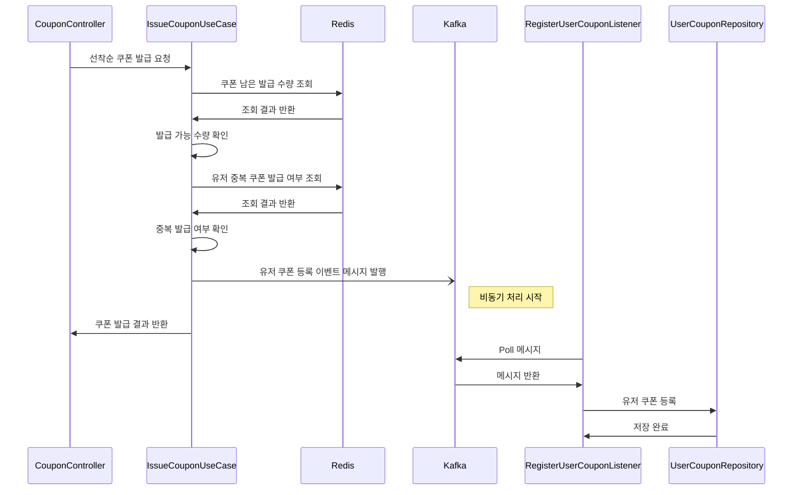
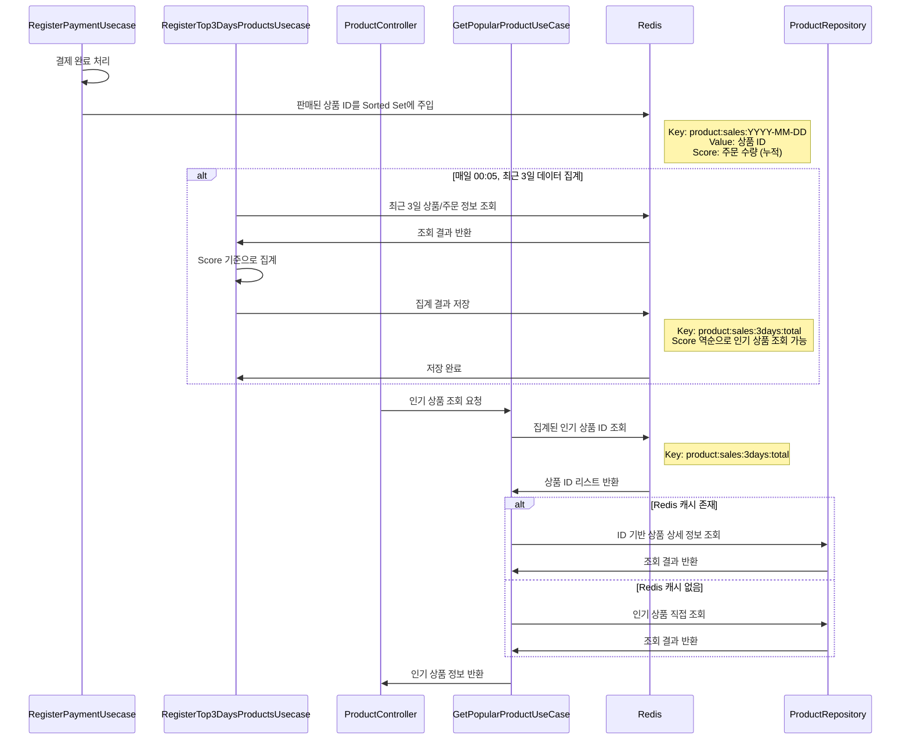

 # 📚목차
- [프로젝트 개요](#프로젝트-개요)
- [요구사항 정리](#요구사항-정리)
  - [기능적 요구사항](#기능적-요구사항)
  - [비기능적 요구사항](#비기능적-요구사항)
- [아키텍처](#아키텍처)
  - [아키텍처 선택 이유](#아키텍처-선택-이유)
- **[API 구현 로직 설명](#api-구현-로직-설명)**
  - [공통 부분](#공통-부분)
  - **[선착순 쿠폰 발급](#선착순-쿠폰-발급)**
  - **[인기 판매 상품 조회(3일)](#인기-판매-상품-조회3일)**
</br>

---

</br>

# 프로젝트 개요
대규모 트래픽을 감당할 수 있는 E-commerce 서비스로서 아래의 API를 제공합니다.
- 잔액 충전/조회 API
- 상품 조회 API
- 주문/결제 API
- 선착순 쿠폰 API
- 인기 판매 상품 조회 API

</br>

---

</br>

# 요구사항 정리
### 기능적 요구사항

| 도메인 | 기능명         | 설명                                                                                                                |
|----|-------------|-------------------------------------------------------------------------------------------------------------------|
| 유저 | 포인트 조회      | 유저는 자신이 보유한 포인트를 조회할 수 있습니다                                                                                       |
| 유저 | 포인트 충전      | 유저는 상품 구매를 위한 포인트를 충전할 수 있습니다                                                                                     |
| 유저 | 포인트 사용      | 유저는 포인트를 사용하여 상품을 결제할 수 있습니다                                                                                      |
| 상품 | 상품 조회       | 특정 상품을 조회하여 이름, 가격, 수량을 확인할 수 있습니다                                                                                |
| 상품 | 전체 상품 조회    | 모든 상품을 조회하여 이름, 가격, 수량을 확인할 수 있습니다                                                                                |
| 상품 | 인기 판매 상품 조회 | 현재 일을 기준으로 최근 3일간 가장 많이 판매된 상품 N개를 조회할 수 있습니다                                                                     |
| 주문 | 상품 주문       | 유저는 아직 재고가 남아있는 상품을 주문할 수 있습니다                                                                                    |
| 주문 | 주문 조회       | 유저는 단건의 주문 내용을 조회하여 주문한 상품의 이름, 가격, 주문 수량과 주문 상태를 확인할 수 있습니다 <br/>주문 상태 종류 : [주문취소, 결제 전, 결제완료, 배송전, 배송중, 배송 완료] |
| 주문 | 전체 주문 조회    | 유저는 모든 주문의 내용을 조회하여 주문한 상품의 이름, 가격, 주문 수량과 주문 상태를 확인할 수 있습니다 <br/>주문 상태 종류 : [주문취소, 결제 전, 결제완료, 배송전, 배송중, 배송 완료]  |
| 주문 | 주문 취소       | 유저는 [결제 전, 결제 완료, 배송 전] 상태의 주문을 취소할 수 있습니다                                                                        |
| 결제 | 결제          | 유저는 취소되지 않은 주문을 포인트를 사용하여 결제를 요청할 수 있습니다                                                                          |
| 결제 | 결제 조회       | 유저는 주문의 결제 상태를 조회할 수 있습니다.. <br/>     결제 상태 종류: [결제 전, 결제 완료, 결제 취소]                                      |
| 쿠폰 | 쿠폰 조회       | 유저는 현재 자신이 사용할 수 있는 쿠폰을 조회할 수 있습니다 <br/>쿠폰 상태 종류: [발급됨, 사용됨]                                                      |
| 쿠폰 | 쿠폰 사용       | 유저는 쿠폰을 사용하여 할인된 금액으로 상품을 구매할 수 있습니다                                                                              |
| 쿠폰 | 선착순 쿠폰 발급   | 유저는 선착순으로 제공되는 쿠폰을 발급 받아 등록할 수 있습니다                                                                               |

### 비기능적 요구사항
* 선착순 쿠폰 발급로 인해 특정 시간대에 트래픽이 몰려 짧은 시간에 많은 요청이 들어오더라도 버틸수 있어야합니다.

</br>

---

</br>

# 아키텍처
해당 프로젝트는 **Clean Architecture**를 적용하였습니다.  
- UseCase 중심 설계와 **DI(Dependency Injection)**를 활용하여 **확장성과 유지보수성**을 보장하도록 구현하였습니다.  
- 서로 다른 도메인의 로직 처리 필요 시에는 **DomainService**에서 담당하도록 분리하였습니다.

</br>

### 아키텍처 선택 이유
많은 프로젝트에서 널리 사용되는 Layered Architecture 대신 **Clean Architecture**를 선택한 이유는 아래와 같습니다.  
- UseCase를 **도메인 기능 단위로 구성**하여 **SRP(단일 책임 원칙)**을 철저히 준수할 수 있습니다.
- 외부 의존성을 최소화하여 **애플리케이션의 범용성과 유지보수성**을 향상이 됩니다.  
- 이러한 이유로 Clean Architecture가 Layered Architecture보다 **우수한 설계 방식**이라고 판단했습니다.

</br>

## 계층 구조 및 특징
```
Controller -> UseCase -> DomainService(선택) -> Repositroy ->  RepositoryImpl(구현체)
```

### Controller
클라이언트로부터의 HTTP 요청을 받아 처리하는 계층입니다. 
<br> `@Valid`을 통해 requestDTO에서 검증을 진행하는 것이 특징입니다.

### UseCase
한가지 기능 또는 목적에 집중된 서비스(Application Service) 계층 입니다.
<br> 도메인 규칙을 사용하여 한가지 기능을 처리하는 계층이며 실질적인 비지니스 로직은 UseCase가 아니라 Domain 내부에서 처리됩니다.

### DomainService(선택)
여러 도메인 로직을 처리하는 도메인 계층입니다. 
<br> 앞서 언급드린대로 이름은 Service이지만 도메인 로직을 처리하는 로직입니다. 이번의 경우 쿠폰을 사용하는 유스케이스에서  <br> 
`쿠폰 사용 여부 확인`, `주문상세의 총금액 계산`, `쿠폰 상태 변경`을 하나의 도메인 서비스 로직으로 묶어서 처리하였습니다.

### Repositroy
도메인이 데이터 베이스 와 상호작용하기 위한 추상화된 계층입니다.
<br> 도메인이 데이터베이스 세부 구현에 의존하지 않도록 하여 결합도를 낮추고, 유연한 구조를 만듭니다.

### Repository(구현체)
RepositoryImpl은 Repository 인터페이스를 실제 데이터베이스 맞게 구현한 구체 클래스입니다.
<br> 인터페이스와 분리되어 있어 데이터 베이스 구현 및 변경 시 도메인이나 상위 계층에 영향을 최소화합니다.

</br>

---

</br>

## 패키지 구조

```
Product 예시
📦 product
│
├── 📁 controller                  ← [Presentation Layer] API 진입점
│
├── 📁 domain                      ← [Domain Layer]
│   ├── 📁 mapper                  ← 엔티티 ↔ DTO 변환 처리
│   ├── 📁 model                   ← 순수 도메인 모델(Entity, VO 등)
│   └── 📁 repository              ← 저장소 인터페이스 (도메인 중심)
│
├── 📁 exception                   ← [도메인/유스케이스 예외 정의]
│
├── 📁 infrastructure              ← [Infrastructure Layer]
│   └── 📁 jpa                     ← JPA 기반 Repository 구현체
│       └── ProductRepositoryImpl.java
│
├── 📁 listener                    ← [이벤트 리스너] 도메인 이벤트 처리
│
├── 📁 scheduler                   ← [Scheduler Layer] 배치/정기 실행 작업
│
└── 📁 usecase                     ← [UseCase Layer / Application Layer]
    └── 📁 command                 ← UseCase 실행에 필요한 요청/응답 DTO
    
```

### 도메인 구조의 패키지 구조를 선택한 이유
추후 도메인별로 계층 구조가 달라지거나 특정 도메인에 추가적인 외부 의존성이 생길 경우,
</br> 패키지 구조를 **도메인 중심으로 구성**하는 편이 **클린 아키텍처**와 **DDD(도메인 주도 설계)** 가 지향하는 바에 더 적합하다고 생각됩니다.

</br>

---

</br>

# API 구현 로직 설명
## 공통 부분
### TestContainer를 활용한 테스트 코드 실행
테스트 코드는 **Junit5**와 **AssertJ**를 활용하여 작성하였습니다.  
테스트는 **단위 테스트**와 **통합 테스트**로 구분하여, 각 레이어의 특성에 따라 아래 기준으로 설계했습니다.

- **Controller 계층 [통합 테스트]**  
  실제 요청과 응답을 검증하는 것이 목적이므로 통합 테스트로 진행하였습니다.  
  - 사용 도구: `@WebMvcTest`, `MockMvc`

- **Service 계층 [단위/통합 테스트]**  
  트랜잭션(DB 의존성)이 필요한 경우 외부 의존성이 강하다고 판단하여 통합 테스트로,  
  그렇지 않은 경우는 단위 테스트로 진행하였습니다.  
  - 사용 도구: `@ExtendWith(MockitoExtension.class)`, `@InjectMocks`, `@Mock`

- **Repository 계층 [통합 테스트]**  
  DB와의 안정적인 상호작용을 검증하는 것이 주 목적이므로 통합 테스트로 진행하였습니다.  
  - 사용 도구: `@DataJpaTest` (JPA), `@MybatisTest` (MyBatis)

</br>

### 테스트 객체 팩토리 (Step 클래스)
테스트 코드의 가독성과 재사용성을 높이기 위해, 테스트 전용 팩토리 클래스(`Step`)를 정의하였습니다.

```java
public class CouponStep {
    private static final Long DEFAULT_USER_ID = 1L;
    private static final Long DEFAULT_COUPON_ID = 1L;

    public static UserCouponCommand defaultUserCouponCommand() {
        return new UserCouponCommand(DEFAULT_USER_ID, DEFAULT_COUPON_ID);
    }

    public static UserCouponCommand userCouponCommandWithUserId(Long userId) {
        return new UserCouponCommand(userId, DEFAULT_COUPON_ID);
    }
}
```

</br>
</br>

###  Redis 분산 락을 AOP 기반으로 구현하여 동시성 문제 해결
초기에는 **비관적 락**을 통해 동시성 문제를 해결했으나, 이는 DB에 부하를 줄 수 있다고 판단하여 **Redis 기반 분산 락**으로 전환하였습니다.  
또한, 분산 락을 **AOP로 구현**함으로써 핵심 비지니스 로직과의 **관심사 분리**와 함께 로직 중복 문제를 해결하였습니다.
```java

public class DistributedLockAspect {

    private final RedissonClient  redissonClient;

    @Around("@annotation(distributedLock)")
    public Object around(ProceedingJoinPoint joinPoint, DistributedLock distributedLock) throws Throwable {
        String key = distributedLock.key();

        RLock lock = redissonClient.getLock(key);
        boolean acquired = lock.tryLock(distributedLock.waitTime(), distributedLock.leaseTime(), TimeUnit.SECONDS);

        if (!acquired) {
            throw new RuntimeException("락 획득 실패");
        }

        try {
            return joinPoint.proceed();
        } finally {
            lock.unlock();
        }
    }
}

```


</br>

---

</br>

## 선착순 쿠폰 발급

### 구현 방식


1. **Redis에 쿠폰 수량 관리**
   - 쿠폰의 남은 수량을 Redis에서 관리하여 **발급 가능 여부를 빠르게 판단**합니다.
   - 중복 발급 여부는 Byte 단위가 아닌 Bit 단위로 저장하는 **Bitmap**으로 관리하여 **메모리 효율**에 신경을 썻습니다.

2. **쿠폰 수량 감소**
   - 쿠폰 수량의 정합성을 보장하기 위해 `decrement()`로 **원자적 감소**를 수행합니다.
   - DB와 Redis를 분리하여 **정합성을 유지하면서도 빠른 조회**가 가능하도록 설계했습니다.

3. **Kafka를 통한 비동기 처리**
   - 쿠폰 발급 요청을 Kafka로 전달하고, **백그라운드에서 순차 처리**함으로써 **대량 트래픽에도 DB 부담을 줄이고 안정성을 확보**했습니다.

### 구현 방식 결정 배경
- **Redis**의 빠른 읽기·쓰기 성능과 **Kafka**의 분산·비동기 처리 특성이 **대규모 트래픽을 안정적으로 처리**하는 데 적합하다고 판단하여 채택하였습니다.
- Redis는 **쿠폰 수량과 유저 발급 정보를 관리**하여 즉시 발급 가능 여부를 판단하고, 중복 발급을 방지합니다.
- Kafka는 **메시지 버퍼링과 비동기 처리**를 통해 DB에 몰리는 부하를 완화하고, 트래픽 폭주에도 **안정적으로 처리**할 수 있도록 합니다.
</br>

---

</br>

## 인기 판매 상품 조회(3일)

### 구현 방식

1. **결제 시 Redis Sorted Set에 판매된 상품의 데이터 주입**

      | 항목 | 설명 |
      |------|------|
      | **key** | `product:sales:YYYY-MM-DD` |
      | **value** | 상품 ID |
      | **score** | 주문 수량<br>- 동일 상품 ID는 결제 시마다 score 증가 |


2. **3일 데이터 집계**
   - 매일 00:05, 최근 3일 데이터를 집계
   - 집계 결과를 `product:sales:3days:total` 키로 생성/갱신
   - Score 역순으로 인기 상품 조회 가능

3. **조회 시 처리**
   - `product:sales:3days:total`에서 상품 ID 조회 후 DB에서 상세 정보 반환


### 구현 방식 결정 배경
- 집계에 사용되는 데이터는 **휘발성이 높고 빠른 읽기·쓰기**가 필요하여, **Redis**를 채택하였습니다.  
- 기존 집계 함수와 다중 조인으로 인한 **조회 성능 저하 구간**만 Redis 캐싱으로 대체하고, PK 기반 DB 조회를 유지하여 **데이터 정합성과 성능**을 동시에 확보했습니다.  
- 상품 정보를 직접 캐싱하지 않고 **ID만 저장**한 이유는 데이터 정합성을 유지하면서, MySQL의 **클러스터링 인덱스**로도 충분한 성능을 확보할 수 있다고 판단했기 때문입니다.

</br>


